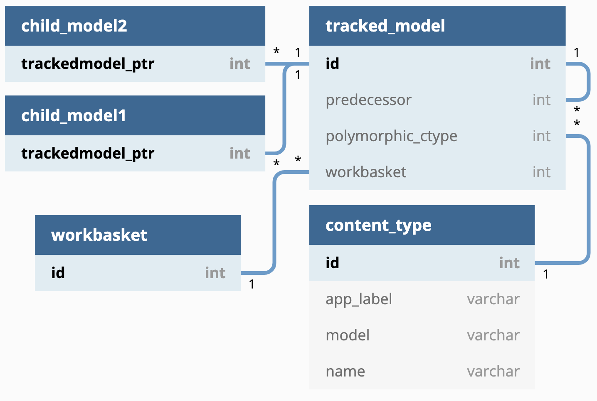

.. _4-use-django-polymorphic-for-multi-table-inheritance:

4. Use Django Polymorphic for Multi-Table Inheritance
=====================================================

Date: 2020-06-12

Status
------

Proposed

Context
-------

The Tariff Management Tool (TAMATO) requires a way to track changes
across the system. This is for multiple reasons, one is for auditing
purposes, another is to show progressive diffs of the data set, on
occasion it is also desirable to see data from a historical standpoint
and what changed with it.

To handle this there needs to be a way of connecting all changes to the
data within the system made since a certain point in time. As all
changes are managed through ``WorkBasket``\ s the logical conclusion is
to use ``WorkBasket``\ s as a basis for finding points of change and
group individual changes on those. Following this logic there must be a
clean method to follow reverse relations from a ``WorkBasket``.

This is also a problem found within the ``WorkBasket`` system itself
which must manage changes and apply them. So naturally these problems
will be solved together.

In essence:

-  It is required to find a set of changes based on a point of time.

-  ``WorkBasket``\ s group changes together based on a single point of
   time.

-  Finding a ``WorkBasket`` at a specific point in time is relatively
   simple.

-  Finding all the objects grouped together by the ``WorkBasket`` holds
   some complexity - this is the problem that this ADR proposes to
   solve.

Decision
--------

This ADR proposes to use `multi-table inheritance`_ where a polymorphic
parent model holds a Foreign Key to a ``Workbasket``. All changeable
data models inherit this polymorphic parent model. This will, as a
result, mask the intermediate (parent) tables on reverse relations to
data models being changed thus simplifying both the queries and code
required to access the data being changed from the ``WorkBasket``.

What does this actually mean?
~~~~~~~~~~~~~~~~~~~~~~~~~~~~~

Multi-table inheritance (MTI)
^^^^^^^^^^^^^^^^^^^^^^^^^^^^^

MTI is useful when multiple models have overlapping columns. Instead of
copying these columns across all the tables, one common table is created
that has these specific columns. The more specific tables then have a
key to this common table. In Object oriented terms the common table is a
concrete class which the more specific models inherit as a parent.

Django supports this and, if coming from the child model, obfuscates the
link to a separate table by allowing you to access the parent attributes
straight from the child object (the parent and child rows are joined in
a single query so performance is not affected).

Polymorphic models
^^^^^^^^^^^^^^^^^^

MTI solves one half of the problem - giving all the child tables an
efficient way to link to their inherited columns, however this could
also be solved with a mixin. The second half of the problem is not
easily solvable with a mixin - this is having efficient reverse
relations from the parent model to the child models. i.e. finding all
the child objects when we only have the parent objects. This is where polymorphism comes in.

Polymorphism of a database object is described as the ability for that
object to take on multiple forms. In this case it is better described as
the parent object having a self-awareness of which child object it
represents. To achieve this in django the parent table has an additional
column holding the content type (essentially the table) of the child
object. In doing this it is possible to group all parent rows by their
child object type. Once grouped a single query can be made for each
child object type to add the child columns to the objects.

The result of this is that, when starting with a list of the parent
objects, the total number of queries to collect all the data is ``N+1``,
where ``N`` represents *the number of types of children in the query*
and ``1`` is the initial query to get all the parent objects.

Alternatives
^^^^^^^^^^^^

One alternative is to use a mixin instead of MTI and polymorphism. This
gives the child objects all the necessary columns without a join being
required, however it removes the convenience of having a single table
other objects can link to. Specifically in TAMATO, it makes it difficult
to go from a ``WorkBasket`` to all the possible connected models. It is
necessary to either have a list of all the connected children types in
the ``WorkBasket`` model - which represents more work and weaker support
across databases - or to have a query against every possible linking
table to check if there is a link - which is inefficient.

Another alternative is single-table inheritance. This is where we have a
single table which can hold multiple models - in this case the
separation of the models from the table data is done in code. This
allows for everything to be done in a single query and it is easy to
work through reverse relations. However validation becomes increasingly
complex and, due to most columns having to be nullable, indexing takes a
significant hit.

Data Model
~~~~~~~~~~

|Tracked Model Schema|

Column Descriptions
^^^^^^^^^^^^^^^^^^^

TrackedModel
''''''''''''

N.B. “related record” is used to describe the child model inheriting the
``TrackedModel``.

-  ``ID`` - Primary Key
-  ``workbasket`` - the related ``WorkBasket``.
-  ``predecessor`` - A foreign key to another ``TrackedModel`` which
   represents the previous iteration of the related record.
-  ``polymorphic_ctype`` - A foreign key to Djangos content type system,
   which stores the details of the table being linked to.

ChildModel
''''''''''

-  ``TrackedModel`` - Both the primary key of the table, and a foreign
   key to the ``TrackedModel`` table - as a result the ChildModel and
   relevant ``TrackedModel`` share the same primary key.

Consequences
------------

SQL
~~~

As discussed there are some performance costs and benefits to weigh up.

Cons:

-  The number of queries in reverse relations will always be ``N+1``.
-  The use of an ``IN`` statement has some performance costs, although
   these are generally negligible.
-  Some code is required between the initial query fetching
   ``TrackedModel``\ s to generate appropriate queries for the related
   tables.

Pros:

-  Most of the above performance hits are incredibly difficult to avoid,
   in relation to other solutions this is rather efficient.
-  The only obviously more efficient solution (single-table inheritance,
   requires 1 query only) lacks significant options for constraining
   data.
-  ``N`` should never be very large given the limited number of models
   to be changed.
-  Likewise the number of objects included in an ``IN`` clause is
   unlikely to ever be very high.
-  The code for this option is surprisingly clean.

To further exemplify how this works some example queries are below.

Query examples
~~~~~~~~~~~~~~

Getting all of one child model
^^^^^^^^^^^^^^^^^^^^^^^^^^^^^^

This query gets all Commodity models as an example:

.. code:: sql

   SELECT trackedmodel.id,
          trackedmodel.polymorphic_ctype_id,
          trackedmodel.workbasket_id,
          ...
          commodity.trackedmodel_ptr_id,
          ...
     FROM commodity
    INNER JOIN trackedmodel
       ON commodity.trackedmodel_ptr_id = trackedmodel.id;

Getting all objects changed in a WorkBasket
^^^^^^^^^^^^^^^^^^^^^^^^^^^^^^^^^^^^^^^^^^^

This set of queries gets all the models changed in a single
``WorkBasket``. In this case a footnote type and 2 commodities were
changed.

This first query gets all the ``TrackedModel``\ s:

.. code:: sql

   SELECT id,
          polymorphic_ctype_id,
          workbasket_id,
          ...
     FROM trackedmodel
    WHERE workbasket_id = 1;

The next two queries are generated in code and then executed.

This one gets all the commodities:

.. code:: sql

   SELECT trackedmodel.id,
          trackedmodel.polymorphic_ctype_id,
          trackedmodel.workbasket_id,
          ...
          commodity.trackedmodel_ptr_id,
          ...
     FROM commodity
    INNER JOIN trackedmodel
       ON commodity.trackedmodel_ptr_id = trackedmodel.id
    WHERE commodity.trackedmodel_ptr_id IN ( 1, 3 );

This one gets all the footnote types:

.. code:: sql

   SELECT trackedmodel.id,
          trackedmodel.polymorphic_ctype_id,
          trackedmodel.workbasket_id,
          ...
          footnotetype.trackedmodel_ptr_id,
          ...
     FROM footnotetype
    INNER JOIN trackedmodel
       ON footnotetype.trackedmodel_ptr_id = trackedmodel.id
    WHERE footnotetype.trackedmodel_ptr_id IN ( 2 );

Getting all of one type of child model from a WorkBasket
^^^^^^^^^^^^^^^^^^^^^^^^^^^^^^^^^^^^^^^^^^^^^^^^^^^^^^^^

This could be done directly in SQL as one query, however the Django ORM
does it by default in 2 (and sometimes by more depending on the code
implementation). The 2 query method uses the following queries:

This first query gets all the tracked models which are commodities.

.. code:: sql

   SELECT trackedmodel.id,
         ...
    FROM trackedmodel
   INNER JOIN content_type
      ON trackedmodel.polymorphic_ctype_id = content_type.id
   WHERE trackedmodel.workbasket_id = 1
     AND content_type.app_label = "commodities"
     AND content_type.model = "commodity";

This second query gets all the commodity details from the
``TrackedModel`` details.

.. code:: sql

   SELECT trackedmodel.id,
         ...
         commodity.trackedmodel_ptr_id,
         ...
    FROM commodity
   INNER JOIN trackedmodel
      ON commodity.trackedmodel_ptr_id = trackedmodel.id
   WHERE commodity.trackedmodel_ptr_id IN (1, 3);

Code
~~~~

There are numerous benefits of this option in the context of code.

Foremost is that this solution only requires the use of a single extra
library which makes use of an MTI mechanism already natively to Django.
This library is django-polymorphic.

The models classes as a result are quite simple, looking like so:

.. code:: python

   class TrackedModel(PolymorphicModel):
       workbasket = models.ForeignKey("workbaskets.WorkBasket", on_delete=models.PROTECT)
       draft = models.BooleanField(default=True)
       live = models.BooleanField(default=False)
       predecessor = models.OneToOneField(
           "self",
           on_delete=models.PROTECT,
           null=True,
           blank=True,
           related_name="successor",
       )

   class FootnoteType(TrackedModel, ValidityMixin):
      footnote_type_id = models.CharField(
          unique=True, max_length=3, validators=[validators.valid_footnote_type_id]
      )
      description = models.CharField(max_length=500)

Accessing a child object is also no different than accessing a normal
django object. On the other hand accessing a ``TrackedModel`` directly
automatically returns you the child instance it represents. As a result
getting all ``TrackedModel``\ s connected to a ``WorkBasket``
automatically returns the relevant actual models:

.. code:: python

   w = WorkBasket.objects.first()
   w.tracked_models.all()
   # Prints:
   # <PolymorphicQuerySet [
   #   <Commodity: Commodity object (1)>,
   #   <FootnoteType: FootnoteType object (2)>,
   #   <Commodity: Commodity object (3)>
   # ]>

This is due to Django-Polymorphic overriding the default queryset class
to fetch the child classes and return those instead. Because of this the
code is always dealing with the child model and not directly with the
``TrackedModel`` unless explicitly stated. The project therefore is
allowed to lean into the template method design pattern. Most of the
generic requirements of ``TrackedModel``\ s can be handled in the
``TrackedModel`` itself. The children will inherit this common code and
can override it with any specific requirements the child model has. An
example would be generating TARIC3 components which could look like:

.. code:: python

   w = WorkBasket.objects.first()
   taric_components = [
       tracked_object.generate_taric()
       for tracked_object in w.tracked_models.all()
   ]

The same can be said for any operation that needs to be applied across
all objects tracked in a ``WorkBasket``. As the code deals with the
child models by default it will, by default, run the code relevant to
that child.

This approach does force the ``N+1`` queries to be made by default. But
cases where the ``TrackedModel`` needs to be interacted with directly
will be rare.

In summary this keeps the number of queries to a relative minimum with
each query itself being performant. It simplifies the code base and
makes it easier for the developers to rapidly create generic solutions
across the system.

.. _multi-table inheritance: https://docs.djangoproject.com/en/3.0/topics/db/models/#multi-table-inheritance