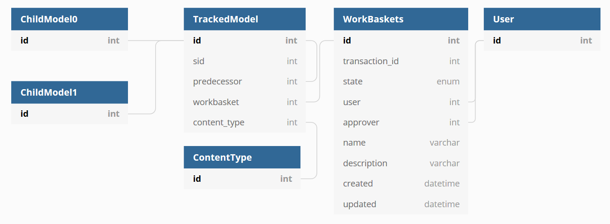

# 7. Changes go through a stateful workflow

Date: 2020-06-02

## Status

Approved

## Context

When a change is made to data in the Tariff Management Tool there are various actions that must take place before it becomes live in border systems. E.g.

1. A user makes changes.
2. The change must be approved by an authorised user.
3. The change must be exported as XML and sent to CDS.
4. CDS systems must approve the change and return a receipt of validity.
5. The changes are published.

We must keep track of the position of a change in this workflow. Previous ADRs have introduced [a Finite State Machine style system](./0004-use-model-tracking-and-workbaskets) for workbaskets and a [live/draft flags style system](./0005-use-django-polymorphic) for tracked models.

We have realised that there are two concepts of "liveness" that arise because we must keep track of changes to a TARIC-style database, which itself is also a versioning system:

* **Database liveness** which is where a row is the most current version of a certain domain object.
* **Operational liveness** which is where a domain object is actually being applied at the border.

Database liveness is dependent on context. Sometimes we will need to see the latest version of something based on a workbasket, or we will need to take into account what has been approved and sent to CDS, or only what has been published. So the mechanism which selects which are the "most current" rows must vary based on the state of the workbasket, and not just a single flag.

Once exposed transactions must be immutable so as to power a change-based API. This means that once a user can download a transaction it cannot be changed, thus the user never has to download it again. We need to take into account that workbaskets will not be approved in order, and CDS may error some transactions and not others, again not in order.

We should also retain the history of all approved transactions which have been sent to CDS as a minimum. This is for both audit and debugging purposes.

## Decision

We will adopt the terms "database-live" and "operationally-live" as per the definitions above in future documentation.

The `TrackedModel` will no longer have a `live` or `draft` flag – instead for this we use the state of the workbasket.

The `predecessor` column on the TrackedModel will be nullable and this is (along with the `update_type`) is how we know if a record is created or updated.

To get the database-live rows, we can perform a query that selects only the model without a `predecessor` for a given `sid`. With suitable indexes this has been shown to be fast. We can control the context of the query by joining to the `WorkBasket` model and filtering based on the `state`.

We will adopt the states as found in the [existing management software](https://github.com/uktrade/trade-tariff-management/blob/master/app/models/workbaskets/workbasket.rb#L31) because we don't yet know enough to remove states that we don't think are needed.

| State | Description |
| ----- | ----------- |
| NEW_IN_PROGRESS | Newly started, but not yet submitted into workflow
| EDITING | Existing item, already on CDS, being edited but not yet submitted into workflow
| AWAITING_APPROVAL | Submitted for approval, pending response from Approver
| APPROVAL_REJECTED | Was not approved, returned to submitter
| READY_FOR_EXPORT | Approved but not yet scheduled for sending to CDS
| AWAITING_CDS_UPLOAD_CREATE_NEW | New item approved and scheduled for sending to CDS
| AWAITING_CDS_UPLOAD_EDIT | Edited item approved and scheduled for sending to CDS, existing version will be end-dated and replaced
| AWAITING_CDS_UPLOAD_OVERWRITE | Edited item approved and scheduled for sending to CDS, existing version will be updated
| AWAITING_CDS_UPLOAD_DELETE | Delete instruction approved and scheduled for sending to CDS
| SENT_TO_CDS | Sent to CDS, waiting for response
| SENT_TO_CDS_DELETE | Delete instruction sent to CDS, waiting for response
| PUBLISHED | On CDS, may or may not have taken effect
| CDS_ERROR | Sent to CDS, but CDS returned an error

The workbasket contains a `transaction_id` that is set when the state changes from `EDITING` to `AWAITING_APPROVAL`, and the states `APPROVAL_REJECTED`, `CDS_ERROR` and `PUBLISHED` are all final. Sending a workbasket back to the editing stage is done by cloning the workbasket and its data.

## Consequences

Workbaskets are only given a `transaction_id` when they are approved and start on their journey to being published. This means transactions will always have an increasing ID, allowing external users to remember a single transaction ID to request more data next time.

Transactions on the external interfaces will be immutable and sequential but discontinuous – there will be some blank transactions representing transactions that were rejected or errored.

This assumes that HMRC don’t require resubmission of failed transactions and that CDS will process all of the things we send it in a single envelope (so that it’s not possible to get transaction 2 in the `PUBLISHED` state and an earlier transaction 1 in the `SENT_TO_CDS` state – but CDS *can* still safely error transactions out of order).

If either of these assumptions is false, we can re-use transaction IDs internally if required and/or have separate IDs for published transactions on the external interfaces.

This does mean it will be hard to implement database constraints looking at a single table because there’s no mechanism in the object table to detect which row is current, so we will implement these in software. This is for good reason as there are going to have to be some in software anyway and it also means that we can run them across different contexts e.g. the database-live rows + a certain workbasket.
