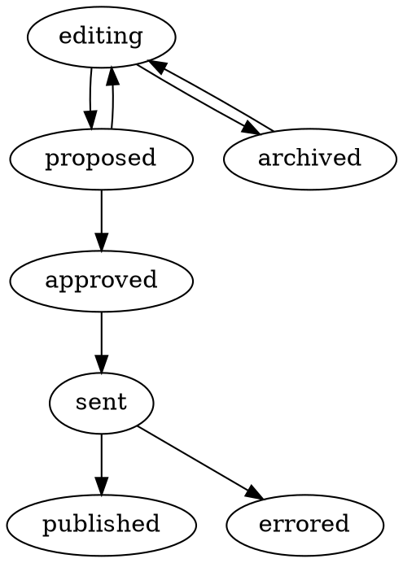

# 8. Simplify workflow states

Date: 2020-08-05

## Status

Approved

## Context

In [a previous ADR](./0007-changes-go-through-a-stateful-workflow) the concept of a stateful workflow and defined associated workbasket states that described it was introduced. There was not yet have a full understanding of the purpose of many of the states or the exact interaction model with CDS.

Learning more about the two systems has shown that there are many states present in the original Trade Tariff Management (TTM) system that are not used or do not appear to have a behavioural impact on the system. TTM also represents workbaskets at a variety of now-redundant states, including "creating" and "editing" as well as both "approved" and "uploaded" states. These have no impact on the final outputs. There are also cases where manual steps have been introduced between states which only serve to slow down the process.

There is a continuing motivation to simplify the tariff for ease of use and understanding. To that end much work has been carried out to merge, adapt or even remove models and systems which are ill designed or serve no purpose (e.g. moving `GoodsNomenclature` to be represented in a true hierarchical tree). It therefore stands to reason that the workbasket states, which form a key part of the user experience, should be reduced to only those necessary for the product to function.

## Decision

The following states for workbaskets will be adopted:

| State | Description |
| ----- | ----------- |
| EDITING | Workbasket can still be edited. |
| PROPOSED | Submitted for approval, pending response from an approver. |
| APPROVED | Approved and scheduled for sending to CDS. |
| SENT | Sent to CDS and waiting for response. |
| PUBLISHED | Received a validation receipt from CDS systems. |
| ERRORED | Sent to CDS, but CDS returned an invalid data receipt. |

The interactions between these states are simpler – once approved there is a single happy path with branches to a single final state for the various unhappy paths. This is represented in the directed graph:

## Consequences

As before, workbaskets that end up in a final state on the unhappy path will need to be cloned before they can be submitted again. This should not have major consequence as most data will be decided in advance and is unlikely to be rejected by an approver. Validation routines should also catch most errors that would cause CDS to reject the transaction.

There is no need for a rejected state and the data can go straight back to be edited if not approved because it has not been given a transaction ID yet. If there needs to be a more powerful editing experience (where past proposed changes can be viewed) a rejected state as another final state from the proposed state can be added.

There is still not a complete understanding of the requirements of the CDS modules if data has errored. If in some cases transactions must be submitted with the same ID there may have to be additional complexity to handle this. It is worth noting that this is **not** supported by TTM, which always numbers transactions sequentially in an envelope starting from 1.
