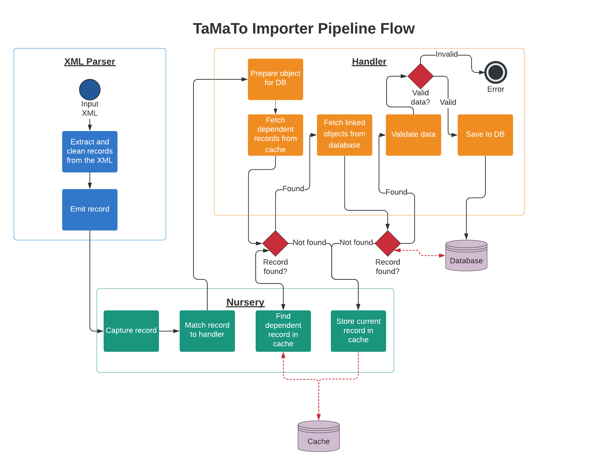

# 10. Convert the XML importer to a pipeline

Date: 2020-08-20

## Status

Proposed

## Context

Migrating legacy and new data into the Tariff Management Tool (TaMaTo) is integral to keeping the system
up-to-date. Historically the serialized data medium has been TARIC3 XML. This is a relatively strict medium,
in terms of its content, which is heavily coupled to the legacy data models. Therefore it is important to have
an importing solution which works with TARIC3 XML. 

Previously a generic XML importing system has been written which extracts XML data into python objects
effectively. However a newly realised problem within the project stops this from being a complete solution.
 
### The problem

Over the course of TaMaTo's redevelopment several data models have been determined as unnecessary abstractions.
These unnecessary models have mostly been merged with related models to keep the system terse and easier to 
understand. For example the legacy system had a `GoodsNomenclature` model (describing a good), a 
`GoodsNomenclatureOrigin` model (describing how one good originated from another good), and a 
`GoodsNomenclatureSuccessor` model (describing how some goods succeeded from another good). This has 
been replaced with the singular `GoodsNomenclature` model which has one extra column `origin`. This single
column can be used to replace the full functionality of the other two tables.  

These changes simplify the development experience whilst keeping the same functionality for users. However these
changes also have a serious impact on importing legacy data. This is because legacy data is naive to the changes made. 
So a model such as `GoodsNomenclature` is still treated as the three original models from the legacy system. Therefore 
the data  received by the importer for the `GoodsNomenclature` model is received as three separate records. There is
no guaranteed order in which the records will arrive. There also is no guarantee that the records will even arrive in
the same transaction.

Consequentially there were two false assumptions made when designing the initial importer:

    1) All records come complete and ready to insert into the database.
    2) All records come in the correct order.

The current importer was designed as a sequential XML parser. It extracts each record individually and
immediately tries to dispatch it to the database as a complete object. In most cases the data is incomplete and the
data validation fails - halting the process.
 

## Decision

To be able to handle the incomplete data records being input the importer is being split into 3 components which
work together as a pipeline. The three components are as follows:

    1) XML Parser - parses XML data into a python dict.
    2) Object Nursery - Collects python dicts and stores them until a complete object can be made.
    3) Object Handler - Fetches python dicts from the nursery and turns them into database objects.

A cache has also been introduced to store the python dicts whilst a handler waits for further data.

### The pipeline

The flow between these three components looks roughly like the following diagram: 



#### The XML Parser

Initially an XML file is passed to the XML parser.

The parser reflects the XML file structure with each element being a `Parser` class. Each `Parser` class contains other
`Parser` classes as attributes which reflect the elements expected to be contained within the "parent" `Parser`s tag.
At the `Record` level of the TARIC3 XML the data is extracted, converted into a python dictionary, and emitted to the
Nursery with the Workbasket ID and XML tag.

The important factor here is how the data is extracted and put into the dictionary. The naming of each piece of data
is integral to how the handler uses that data later on.

##### Code example

Considering a sample XML like:

```xml
<transaction>
    <message>
        <record>
            <transaction.id>1</transaction.id>
        </record>
        <record>
            <transaction.id>2</transaction.id>
        </record>
    </message>
    <message>
        <record>
            <transaction.id>3</transaction.id>
        </record>
        <record>
            <transaction.id>4</transaction.id>
        </record>
    </message>
</transaction>
```

A basic set of XML Parser classes may look like:

```python
from importer.namespaces import ENVELOPE
from importer.namespaces import Tag
from importer.parsers import ElementParser
from importer.parsers import TextElement

class Record(ElementParser):
    tag = Tag("record")
    transaction_id = TextElement(Tag("transaction.id"))


class Message(ElementParser):
    tag = Tag("app.message", prefix=ENVELOPE)
    record = Record(many=True)


class Transaction(ElementParser):
    tag = Tag("transaction", prefix=ENVELOPE)
    message = Message(many=True)
```


#### The Object Nursery

The Object Nursery acts as a go-between for the parser. The nursery itself does very little. But it is here where
the handling of incomplete records and belated linked records is enabled (not handled, enabled).

The Nursery has 4 core functions:

    1) To receive a python dictionary with a workbasket ID and a unique identifier for the record type (in the case 
       of the XML parser the unique identifier is the tag name).
    2) To match these python dictionaries against the handlers responsible for building them into database records.
    3) To store any records that cannot yet be processed by a handler.
    4) To fetch a record when it is ready to be processed by a handler.

It is important to note that the Nursery does not know when a record is ready to be processed or when it needs to
be stored. Instead it takes the cue for these actions from the handler being used. The nursery simply presents an
interface for the handler to interact with the cache, whilst also acting as a gateway before to start the handling
process. 

##### The record cache

The record cache is an intermediate storage which holds record objects. These record objects contain their
data, workbasket ID, and a unique identifier matching them to their handler. The format of the cache does not
matter as long as a standard interface is present between the cache and the nursery. This means the cache could
be anything ranging from local file storage to a redis cluster to an in process dictionary. Currently the most
simple approach has been taken - an in process dictionary.

#### The Object Handler

The Object Handler is where most of the processing happens.

A handler defines the serializer it uses to validate data and insert the data into the database. It also defines 
the unique identifier required to match it to a record. It defines any other handlers it may be interdependent on. 
Lastly it defines any other database records it may have foreign keys to and how to find the relevant data for this 
key.   

When a handler receives a record it uses the above definitions to first try and resolve any depdendencies and merge
their data together. If the dependencies are found and merged the handler then tries to build the foreign keys by 
finding records in the database.

If either of the above steps fail the handler returns a falsy message to the nursery. The nursery takes a falsy
value to indicate the current record needs to be cached for later processing. It is this mechanism that allows the
importer to handle partial data being passed to it with an indeterminate order. If the data is determined to be
incomplete it is simply cached and then attempted to be reprocessed when one of the dependent records is given
to a handler.

If both steps are successful the handler validates the data and inserts it into the database. If either validation
or insertion fails then an error will be raised.

## Consequences

The system is relatively complex but has several benefits.

### Pros:

#### Highly customisable

Both handlers and parsers can be changed extensively to match individual model needs.

#### Highly Decoupled

Most of the system acts in a decoupled way. The Nursery doesn't care where it gets data from. Nor does the nursery 
care where the data is cached. Nurseries don't even need Handlers to act in the same way at all, they just need
something to match the unique identifiers against. Handlers similarly expect a nursery like object but don't actually
care if it  is a nursery - they just need an interface to the cache.

With this in mind it is simple to change the actual caching system. Or to add a new integration for other clients
who don't want to use TARIC XML as an input. It is also simple to create entirely custom handlers for certain models.

#### Works with existing serializers

API serializers are reused for validation purposes, easing some of the complexities.

### Cons (many of these are still the case for alternative solutions):

#### It's complex

There are a lot of moving parts involved in the system. This makes it relatively fragile and non-trivial to
conceptualize while working on it.

#### Doesn't handle incomplete data well

This is incomplete data that cannot be completed. If partial data comes through and its dependencies do not, the data
will end up stuck in the cache. The nursery will not handle this.

#### Relies on unique keys actually being unique

An assumption is made that we can build unique keys for each record using the identifying data it contains. This
may not be the case (keys may not be unique). In this case records in the cache may be overwritten.

#### Doesn't handle optional foreign keys well

Optional foreign keys are generally ignored if not found. This may be a problem when the foreign keys are presented
later on.


## Alternatives Considered

### Handling dependencies in the XML

Another solution was to let the XML parser handle the entire process. If an interdependent record is found it could
pass it to the parent element. The parent element would look for dependencies and if not find any would pass it to
its parent. This would carry on recursively until all dependencies found.

This approach is similar to the one taken (store data until the dependencies are found). But everything is done
within the parser. As a result there are 3 issues with this approach compared to the current solution:

    1) There is no guarantee the dependent data is found within the same XML file being parsed.
    2) The system is tightly coupled, it would be far harder to adapt to varying model needs.
    3) The storage is tied to the system memory which may present problems for big inputs.  


### Sorting the records within the XML

Another solution was to parse the XML and sort it before inserting rows. This would allow assigning unique keys,
merging dependencies and then inserting in the order we expect. However the main issue with this is the lack of
assurance on where items come within the input. Therefore the amount of data required to store in memory could be
significant.

However this solution may still be desirable. The nursery approach does not preclude sorting as an impossibility.

## Future suggestions

### Clean up process

Currently there is no way to know when an input is finished. As a result this may leave straggling records in the
cache. A clean up process should be implemented to allow these records to be wrapped up before the process dies.

### Batching

As the nursery controls when records are first handled it would be trivial to implement a batching system. This would
involve the nursery holding onto records at first until some milestone is reached (e.g. _x_ number of records, or 
an entire XMl transaction or similar). Once the milestone is reached the entire batch could be processed in one go.

### Implement sorting

If batching is implemented then sorting the data appropriately would be a trivial addition to this system.

### More intricate dependency and link checks

Currently the system for adding links is very adaptable, however the system for _checking_ if a link is needed is 
not. It may be worth adding more complex checks (probably function based). This would allow the importer to more
closely match the business rules.
