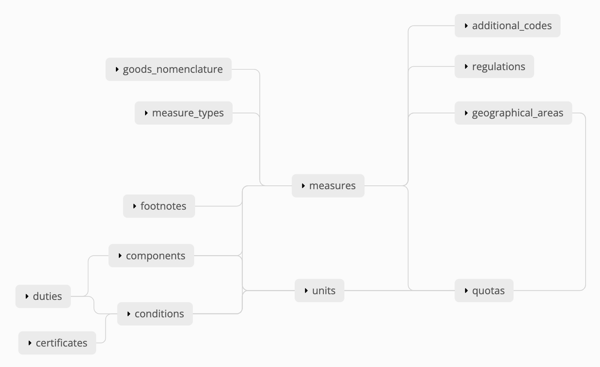

16. High-Level Abstractions for Trade Policy Regimes
====================================================

Date Proposed: 2022-02-24
Date Approved: N/A

Status
------
Proposal

Problem Statement
----------------

The TARIC-3 Data Model
~~~~~~~~~~~~~~~~~~~~~~

TaMaTo follows TARIC-3, a set of specifications for setting customs rules in the European Union. TaMaTo implements the TARIC-3 Record Specification as its data model. The data model follows a snowflake-like schema with one central entity and multiple layers of normalized dimension tables.

The central entity is called a **measure**. Each measure reflects one customs rule. The measure is connected to several multi-layered dimensional entities, which can be logically placed into one of two groups.

The first group of dimensional entities define the **context** of the measure. Each measure must be linked to a *measure type*, a *commodity* in the *goods nomenclature* hierarchy that is subject to the customs rule, a *geographical area* of origin for which the rule applies, and a generating *regulation* on which the rule is based. A measure may also be linked to an optional *additional code*, which is sometimes used for company exemptions.

The second group of dimensional entities capture the measure **facts**, i.e. the customs rule itself. The measure type and the particular details of the customs rule will determine which fact dimensions a specific measure will be linked to. For example, a third country duty will require duty rates defined via *measure components*); import and export controls will use *measure conditions* that reference required *certificates*; trade quotas required *quota order numbers* and *quota definitions*; suspensions sometimes require additional *footnotes*, etc.

A top-level overview of the TARIC-3 data model is provided below. Each group of dimensional entities includes its own mini-ERD as the data model is in third normal form.

Challenges Imposed by the Data Model
~~~~~~~~~~~~~~~~~~~~~~~~~~~~~~~~~~~~
Snowflake schemas have known disadvantages when there are too many layers of dimensions - in terms of both read performance (due to complex joins) and complexity of writes. In addition, the TARIC-3 record specification attempts to conform a range of different trade policy scenarios to a single schema, introducing further complexity in terms of the kinds of in- and out-of-schema business rules that should be enforced for each policy.

Specific challenges with the TARIC-3 data model include:

1. **Mapping customs rules to the data model is not trivial.**  Depending on measure type and other particularities, a customs rule may need to use one set of fact-type dimensions and not others. For example, it may need components but not conditions or quotas; it may have both components and quotas; it may or may not require footnotes; etc. This means that granular customs rule implementations can be challenging and error-prone.
   
  - TaMaTo partially addresses this issue through the use of ``measure creation patterns``. These are essentially facades that ensure proper handling of null cases and support the use of duty expressions in order to avoid manual setup of individual measure components.
  - While patterns are certainly beneficial, they are not aware of policy regime context. Therefore, while patterns help ensure that data entries are *valid*, they can't guarantee that entries are *correct* (i.e. they reflect trade policies as intended).
  
2. **Customs rules not aware of policy regime context.** Customs rules are often subject to trade policy regimes such as free trade agreements (FTA-s) or most favored nation (MFN) treatment. Trade policies often span multiple commodities and multiple time periods. For example, staging rates in an FTA may define how the duty rate for a given range of commodities imported from the trade partner may decline gradually over the course of several years. This is one policy that needs to be reflected in multiple individual customs rules via individual measures, one for each combination of commodity and validity period.
   
  - Importantly, this is not a *bulk entry* issue. TaMaTo does provide utilities (e.g. a TARIC envelope importer and a configurable excel importer), which enable bulk load of a large number of data entries at a time. But the source files for bulk entry still need to outline customs rules one measure at a time, and they provide no meta context around the policy regime

Associated Costs and Risks
~~~~~~~~~~~~~~~~~~~~~~~~~~
The low-level data entry approach for customs rules in TaMaTo imposes a range of costs and operational risks:

1. Data entry can be *slow and tedious* both via the backend or the UI. This leads to delays in implementation of trade policies at the border (sometimes, these delays are significant and are measured in months).
2. Data enty is *subject to errors* - including both validation and correctness errors. Historically, this has often led to costly iterations during the preparation of tariff changes and the exchange of information on tariff changes with HMRC. In addition, tariff corrections, where existing policies were not implemented as intended, are also commonplace.
3. The *highly complex low-level data model* has resulted in high dependency on key talent that has sufficient understanding of, and experience with, this model; onboarding of new talent is slow and challenging; and it has been difficult to democratize the ability to edit the tariff, which would improve operational resilience
   
  - It is useful to point out that the introduction of the Tariff Editor UI does not address this issue. It relieves the dependency of MTPO tariff managers on TAP team data engineers, but then single points of dependency develop in the tariff manager team as well

Proposed Solution
-----------------

This ADR proposes the introduction of high-level abstractions for trade policy regimes.

Main Responsibilities
~~~~~~~~~~~~~~~~~~~~~
This abstraction later has two main responsibilities:

1. Ensure **correctness** of tariff changes in the context of the specific policy regime
2. Enable easier implementation of tariff changes using business language familiar to policy teams (as opposed to the technical jargon of TARIC-3), thus democratizing access for a broader base of authorised users who may wish to edit the tariff

Key Implementation Principles
~~~~~~~~~~~~~~~~~~~~~~~~~~~~~
The abstraction layer folows three key implementation principles:

1. Exsiting TaMaTo code base and functionality is unaffected - there is no refactoring and there are no breaking changes
2. Trade policy regime abstractions are configurable - trade regimes evolve and not all scenarios can be predicted upfront; therefore there are no hard-coded policy rules and there is no hard-coded nomenclature of regimes
3. Graceful migration away from the TARIC-3 data mode is enabled but not required - TaMaTo is TARIC-compliant as long as it can ingest and transmit xml envelopes that conform to the TARIC-3 Messaging schema and include record entries that do not violate TARIC-3 processing rules; this means that TaMaTo does not necessarily need to follow the snowflake-like TARIC-3 data model down the line
4. The abstraction layer should be highly compatible with the notion of BDD - it should be extremely straightforward to define a feature with all relevant scenarios for each policy regime being implemented, in order to assert the **correct** behavior of the implementation

Two Key Design Elements
~~~~~~~~~~~~~~~~~~~~~~~~
The proposed solution centers on the use of two main abstractions:

1. **Measure Type Entities.** These are responsible for managing writes to low-level TARIC-3 model entities. of a given measure type, with all the peculiarities that are specific to that measure type

  - there is one of these entities for each measure type, responsible for handling all the peculiarities related to that specific measure type;
  - all measure type entities share a common interface, ensuring the ability to automatically determine diffs vs current database state and apply changes accordingly
  - measure types rarely change, so building up the library of measure type entities a one-off investment
  - measure type entities are *not* meant to be invoked directly when implementing tariff changes

2. **Trade Policy Regime Aggregates.** These are responsible for mapping arbitrary input data specifications to a list of measure type entities for the purposes of implementing tariff changes

  - the input data specifications can be literally any specification in any format (strings, json payloads, etc.)
  - policy regime aggregates share a common interface, ensuring the ability to transcode inputs, to provide comprehensive previews of pending changes to validate policy implications, and to apply a policy
  - policy regime aggregates are meant to be invoked directly when implementing tariff changes

Measure Type Entities
~~~~~~~~~~~~~~~~~~~~~

  For the purposes of formalizing the proposed design, pseudocode will be favored over software diagrams. This will be followed by worked mock examples.

The **measure type entities** are "necessary middleware" for this design. The interface could look as follows:::

  class MeasureTypeEntity(ABC):
      def __init__(self, data: MeasureData) -> None:
          self.id: uuid.UUID = uuid.uuid4()
          self.data = data
          ...

      @abstractmethod
      def get_diffs(self, allow_exists: bool) -> tuple[MeasureDiff]:
          ...

      @abstractmethod
      def apply_changes(self, allow_exists: bool) -> tuple[Transaction]:
          ...

The worked examples provided later in this ADR demonstrate possible concrete implementations of this interface.

Note the `allow_exists` parameter in the code snippet above - this can be used to govern how the system treats `create` and `update` changes - i.e. whether they're considered sane and valid in the context of current db state or not.

The ``MeasureData`` and ``MeasureDiff`` models require some more explanation here.

MeasureData Model
_________________

``MeasureData`` is a data model very similar to the existing ``Measure`` Django ORM model in TaMaTo, but with two key differences:
- it is simply a container of pending changes, and does not require valid references to other Django ORM objects
- it is responsible for validating the sanity of the inputs (but does *not* run any business rules)

A possible implementation could look like this:::

  @dataclass(frozen=True)
  class MeasureConditionData:
      condition_code: str
      action_code: str
      certificate: Optional[str] = None

      def __post_init__(self):
          self._validate_condition_code()
          self._validate_action_code()
          self._validate_certificate()

      def _validate_condition_code(self):
          ...

      def _validate_action_code(self):
          ...

      def _validate_certificate(self):
          ...

  @dataclass(frozen=True)
  class MeasureData:
      commodity_code: str
      geographical_area_code: str
      measure_type: int
      validity_start: date
      generating_regulation_id: str

      validity_end: Optional[int] = None
      duty_expression: Optional[str] = None
      footnotes: Optional[Sequence[str]] = None
      conditions: Optional[Sequence[MeasureConditionData]] = None
      quota_order_number: Optional[str] = None
      terminating_regulation_id: Optional[str] = None

      sid: Optional[int] = None

      def __post_init__(self) -> None:
          self._validate_commodity_code()
          self._validate_geographical_area_code()
          self._validate_measure_type()

          self._validate_validity_dates()
          
          self._validate_duty_expression()
          self._validate_quota_order_number()
          self._validate_conditions()
          self._validate_footnotes()
          self._validate_regulation_ids()

          self._validate_measure_sid()

      def _validate_commodity_code(self) -> None:
          ...

      def _validate_geographical_area_code(self) -> None:
          ...

      def _validate_measure_type(self) -> None:
          ...

      def _validate_validity_dates(self) -> None:
          ...

      def _validate_duty_expression(self) -> None:
          ...

      def _validate_quota_order_number(self) -> None:
          ...
          
      def _validate_conditions(self) -> None:
          ...
          
      def _validate_footnotes(self) -> None:
          ...
          
      def _validate_regulation_ids(self) -> None:
          ...
          
      def _validate_measure_sid(self) -> None:
          ...
          

MeasureDiff Model
_________________

`MeasureDiff` is a model analogous in function to diff models TaMaTo already uses for handling commodity code changes.
It takes the *mutable* attributes of a measure and compares how they are different to a corresponding existing measure, if any.

  - There is more than one diff for each `MeasureTypeEntity` instance because an the validity period of an incoming tariff change may overlap with multiple existing measures in the database, all of which need to be captured
  - There is an opportunity to preview business rule violations here, similar to the ``side effects`` pattern currently used in the commodity code importer. Although included in the specification, this should be considered optional

The model could be implemented as follows:::

  @dataclass
  class Conflict:
      business_rule: str
      related_measure_sids: Sequence[str]

  @dataclass
  class MeasureDiff:
      data: MeasureData
      allow_exists: bool

      validity_start: Optional[date] = None
      validity_end: Optional[date] = None
      duty_expression: Optional[str] = None
      
      new_footnotes: Optional[Sequence[str]] = None
      new_conditions: Optional[Sequence[MeasureConditionData]] = None
      old_footnotes: Optional[Sequence[str]] = None
      old_conditions: Optional[Sequence[MeasureConditionData]] = None

      conflicts: Optional[Sequence[Conflict]] = None # business rule codes

Trade Policy Regime Aggregates
~~~~~~~~~~~~~~~~~~~~~~~~~~~~~~
The **aggregates** are the "guardians" for all changes to the tariffs. They enable changes in the context of a regime. A common interface could look like this:::

  class TradePolicyRegimeAggregate(ABC):
      name: str = None
      transcoder: TradePolicyRegimeTranscoder = None

      def __init__(self):
          self.id: uuid.UUID = uuid.uuid4()

      def get_diffs(cls, data: Any, allow_exists: bool) -> Iterator[MeasureDiff]:
          """Use this to generate a compehensive review of changes before implementing any of them!"""
          entities = self.transcoder().decode(data)
          return chain(*(entity.get_diffs(allow_exists) for entity in entities))
      
      @abstractmethod
      def apply_policy(self, data: Any, allow_exists: bool) -> tuple[Transaction]:
          ...

The worked examples provided later in this ADR demonstrate possible concrete implementations of this interface. 

However, the ``TradePolicyRegimeTranscoder`` class deserves particular attention here.

TradePolicyRegimeTranscoder
___________________________

The ``TradePolicyRegimeAggregate`` is nothing more than a guardian class for implementing regime-centric tariff changes. But the configurable data specification for each regime, and the logic for how it maps to a tuple of ``MeasureTypeEntity`` instances both live in the ``TradePolicyRegimeTranscoder``:::

  class TradePolicyRegimeTranscoder(ABC):
      schema: Any = None
  
      @abstractclassmethod
      def decode(cls, data: dict[str, Any]) -> tuple[MeasureTypeEntity]:
          ...

      @abstractclassmethod
      def encode(cls, entities: Sequence[MeasureTypeEntity]) -> Any:
          ...

TradePolicyRegimeRegister
_________________________

It is a good practice to provide a formal registry class where all regime aggregates of interest could be loaded upon initialization of an app or service. Below is a register that could fit the bill for this ADR:::

  class TradePolicyRegimeRegister:
      def __init__(self) -> None:
          self._regimes: dict[str, TradePolicyRegimeAggregate] = {}

      def register_regime(self, aggregate: TradePolicyRegimeAggregate):
          self._policy_transcoders[policy_name] = transcoder
      
      def get_diffs(self, policy_name: str, data: dict[str, Any], allow_exists: bool) -> Iterator[MeasureDiff]:
          try:
              transcoder = self._policy_transcoders[policy_name]
          except KeyError:
              ...

          managers = transcoder.decode(data)

          return chain(*(manager.get_diff(allow_exists) for manager in managers))

      def apply_policy(self, policy_name: str, data: dict[str, Any], allow_exists: bool):
          try:
              transcoder = self._policy_transcoders[policy_name]
          except KeyError:
              ...

          managers = transcoder.decode(data)
          
          for manager in managers:
              manager.apply_changes(allow_exists)

Worked Example - FTA Staging Rates
~~~~~~~~~~~~~~~~~~~~~~~~~~~~~~~~~~

Believe it or not, this is all we need for a mock worked example.

Let's take the case of a staging rate from a FTA and build a policy regime aggregate around it.

  - in real-world scenarios, the scope for a regime aggregate could be set at any level - e.g. instead of staging rate, maybe there could be an aggregate for an entire FTA altogether
  - a good design question to ask would be how much *generality* is introduced in your aggregate - this ADR offers the ability to **avoid generality**, because typically abstractions work based when combined with configurable specificity.

Staging Rate Schema
__________________

We will first define a schema, which allows us to define staging rates across several commodities and annual periods. 

  - this is just a mock schema for example's sake, a real-world implementation could be very different, based on the judgement of the implementer;
  - also the choice of json is arbitrary, it can be anything from string to yaml or xml;
  - transcoders are independent of each other and each may implement its own schemas and formats, although it is probably a good practice to establish some consistency across all)

In lieu of a difficult to understand json schema document, let's illustrate our spec with a sample payload:::

  {
    "FTA": "Central and Latin America FTA",
    "origin": "CO",
    "regime": [
      {
        "codes": ["0930", "0940"],
        "rates": [
          {
            "start_date": "2022-01-01",
            "end_date": "2022-12-31",
            "duty_sentence": "3.00%"
          },
          {
            "start_date": "2022-01-01",
            "end_date": "2022-12-31",
            "duty_sentence": "3.00%"
          },
          {
            "start_date": "2023-01-01",
            "end_date": "2023-12-31",
            "duty_sentence": "2.00%"
          },
          {
            "start_date": "2024-01-01",
            "end_date": null,
            "duty_sentence": "1.00%"
          }
          ]
      }
    ]
  }

Staging Rate Transcoder
______________________

We need a specialized ``transcorder`` for our case:::

  class StagingRateTranscoder():
      schema: Any = {...} // the json schema here
  
      @abstractmethod
      def decode(self, data: dict[str, Any]) -> tuple[MeasureTypeEntity]:
          // naive implementation for illustrative purposes,
          // use something schema-aware in real world cases
          area = data["origin"]
          regime = data["regime"]
          codes = regime["codes"]
          rates = regime["rates"]
          measure_type = 142

          entities = []
          
          for code in codes:
            for rate in rates:
              entity = TariffPreferenceEntity(
                data = MeasureData(               // remember from earlier, this is NOT a measure
                  commodity_code=code,
                  geographical_area_code=area,
                  measure_type=measure_type,
                  validity_start=rate["start_date"],
                  validity_end=rate["end_date"],
                  duty_expression=rate["duty_sentence"]
                )
              )

              entities.append(entity)
          ...

          return tuple(entities)

      @abstractmethod
      def encode(self, entities: Sequence[MeasureTypeEntity]) -> Any:
          // this would be a similarly trivial job of mapping a list of entities
          // to a valid payload for this transcoder
          ...

TariffPreferenceEntity
______________________

The above code snippet includes creating an instance of a class called ``TariffPreferenceEntity``.
That's a concrete implementation of the MeasureTypeEntity interface:::

  class TariffPreferenceEntity(MeasureTypeEntity):
      def get_diffs(self, allow_exists: bool) -> tuple[MeasureDiff]:
          // It should know to check components but not conditions and quotas, etc.
          ...

      def apply_changes(self, allow_exists: bool) -> tuple[Transaction]:
          diffs = self.get_diffs(allow_exists)    

          // it needs to determine whether to create, update or delete components
          // based on a changed duty expression for example,
          // a functionality that already exists in TaMaTo
          ...

          // This class could inherit from an intermediate class
          // instead of directly from MeasureTypeEntity,
          // with that intermediate class performing common tasks
          // such as determining validity period overlaps
          ...

          // and so on until a set of transactions
          // with the necessary records in them are produced
          ...

          return tuple(transactions)
  

StagingRateAggregate
____________________

Ok, let's add the specialized StagingRateAggregate next:::

  class StagingRateAggregate(TradePolicyRegimeAggregate):
      name = "Staging Rates"
      transcoder = StagingRateTranscoder

      def apply_policy(self, data: Sequence[dict[str, Any]], allow_exists: bool) -> tuple[Transaction]:
          // Now imagine for example that you're processing the staging rate sheet
          // of a large TIG reference file that covers multiple FTA-s
          // that gives us a sequence of staging rate payloads.
          // Obviously your real-world scenario could involve
          // something very different, you can implement any specialized case here

          transactions = []

          for payload in sequence:
            entities = self.transcoder.decode(payload)

            for entity in entities:
              transactions.extend(entity.apply_changes(allow_exists))

          return transactions

PolicyRegister
______________

Finally, provide an instance of the policy register with the staging aggregate registered on it, so that it can be used in a session:

register = TradePolicyRegimeRegister()
register.register_regime(StagingRateAggregate())

Opportunity: Attach an Event Store
----------------------------------

One of the key implementation principles stated earlier was that *"graceful migration away from the TARIC-3 data mode is enabled but not required"*.

There is a clear opportunity here, once the comprehensive library of **measure type entities** and a reasonable coverage of **regime aggregates** are in place, to attach an event store to the aggregates.

Such event store would, in similar append-only fashion as the TARIC database itself, record all  state changes made via the aggregate *at the regime level*, with all the benefits typically provided by event stores, such as replays, snapshots, etc.

Over time, this can cover the entire relevant tariff, providing an opportunity to wean off the low-level TARIC3-centric data model that TaMaTo uses today (this would also require adaptation of business rules and a new TARIC XML envelope transcoder).

The reference design for this is outside the scope of this ADR, but with a separate **UK trade policy data specification** developed at DIT in the future, such event store design would be a natural next step from here.
